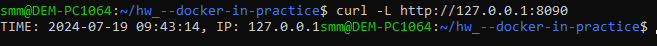

# Домашнее задание к занятию 5. «Практическое применение Docker» - Михалёв Сергей


## Задача 0
1. Убедитесь что у вас НЕ(!) установлен ```docker-compose```, для этого получите следующую ошибку от команды ```docker-compose --version```
```
Command 'docker-compose' not found, but can be installed with:

sudo snap install docker          # version 24.0.5, or
sudo apt  install docker-compose  # version 1.25.0-1

See 'snap info docker' for additional versions.
```
В случае наличия установленного в системе ```docker-compose``` - удалите его.  
2. Убедитесь что у вас УСТАНОВЛЕН ```docker compose```(без тире) версии не менее v2.24.X, для это выполните команду ```docker compose version```  
###  **Своё решение к задачам оформите в вашем GitHub репозитории!!!!!!!!!!!!!!!!!!!!!!!!!!!!!!!!**

**Решение**
- скриншот веб-интерфейса RabbitMQ
  * 

-------
 ## Задача 1
1. Сделайте в своем github пространстве fork репозитория ```https://github.com/netology-code/shvirtd-example-python/blob/main/README.md```.   
2. Создайте файл с именем ```Dockerfile.python``` для сборки данного проекта(для 3 задания изучите https://docs.docker.com/compose/compose-file/build/ ). Используйте базовый образ ```python:3.9-slim```. Протестируйте корректность сборки. Не забудьте dockerignore. 
3. (Необязательная часть, *) Изучите инструкцию в проекте и запустите web-приложение без использования docker в venv. (Mysql БД можно запустить в docker run).
4. (Необязательная часть, *) По образцу предоставленного python кода внесите в него исправление для управления названием используемой таблицы через ENV переменную.
---

**Решение**
1. Создан [Dockerfile.python](Dockerfile.python)
2. Запустил в контейнере Mysql
   * 
3. Запустил проект без докера с спользованием виртуального окружения
   * 
   * 
4. Как вариант развития темы для чтения переменнх окружения из файла .env можно установть библиотеку *dotenv*. На скриншоте приведёт вариант отладки подключения к базе данных.
   * 

------
## Задача 3
1. Изучите файл "proxy.yaml"
2. Создайте в репозитории с проектом файл ```compose.yaml```. С помощью директивы "include" подключите к нему файл "proxy.yaml".
3. Опишите в файле ```compose.yaml``` следующие сервисы: 

- ```web```. Образ приложения должен ИЛИ собираться при запуске compose из файла ```Dockerfile.python``` ИЛИ скачиваться из yandex cloud container registry(из задание №2 со *). Контейнер должен работать в bridge-сети с названием ```backend``` и иметь фиксированный ipv4-адрес ```172.20.0.5```. Сервис должен всегда перезапускаться в случае ошибок.
Передайте необходимые ENV-переменные для подключения к Mysql базе данных по сетевому имени сервиса ```web``` 

- ```db```. image=mysql:8. Контейнер должен работать в bridge-сети с названием ```backend``` и иметь фиксированный ipv4-адрес ```172.20.0.10```. Явно перезапуск сервиса в случае ошибок. Передайте необходимые ENV-переменные для создания: пароля root пользователя, создания базы данных, пользователя и пароля для web-приложения.Обязательно используйте уже существующий .env file для назначения секретных ENV-переменных!

2. Запустите проект локально с помощью docker compose , добейтесь его стабильной работы: команда ```curl -L http://127.0.0.1:8090``` должна возвращать в качестве ответа время и локальный IP-адрес. Если сервисы не стартуют воспользуйтесь командами: ```docker ps -a ``` и ```docker logs <container_name>``` 

5. Подключитесь к БД mysql с помощью команды ```docker exec <имя_контейнера> mysql -uroot -p<пароль root-пользователя>```(обратите внимание что между ключем -u и логином root нет пробела. это важно!!! тоже самое с паролем) . Введите последовательно команды (не забываем в конце символ ; ): ```show databases; use <имя вашей базы данных(по-умолчанию example)>; show tables; SELECT * from requests LIMIT 10;```.

6. Остановите проект. В качестве ответа приложите скриншот sql-запроса.
-----
**Решение**

1. Создан [compose.yaml](compose.yaml) соответствующими сервисами.
2. Запустил проект в WSl
   ```docker compose -f compose.yaml up -d```
   * 
   С точки зрения необходимости получения эстетического удовольствия от проделанной работы проверил в браузере.
   * 
3. Получил данные из базы virtd контейнера db
   * 
   
-----

## Задача 4
1. Запустите в Yandex Cloud ВМ (вам хватит 2 Гб Ram).
2. Подключитесь к Вм по ssh и установите docker.
3. Напишите bash-скрипт, который скачает ваш fork-репозиторий в каталог /opt и запустит проект целиком.
4. Зайдите на сайт проверки http подключений, например(или аналогичный): ```https://check-host.net/check-http``` и запустите проверку вашего сервиса ```http://<внешний_IP-адрес_вашей_ВМ>:8090```. Таким образом трафик будет направлен в ingress-proxy.
5. (Необязательная часть) Дополнительно настройте remote ssh context к вашему серверу. Отобразите список контекстов и результат удаленного выполнения ```docker ps -a```
6. В качестве ответа повторите  sql-запрос и приложите скриншот с данного сервера, bash-скрипт и ссылку на fork-репозиторий.


